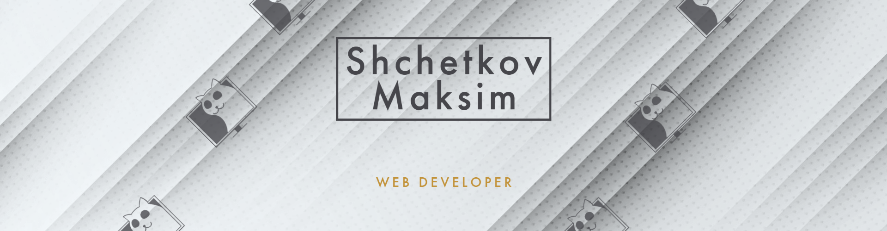

 
As someone who is just starting out in the field of software engineering, I have a deep passion for web programming and a strong drive to develop scalable, maintainable, and user-friendly web applications that provide a seamless user experience. To achieve this, I am constantly learning and experimenting with new technologies and frameworks, always seeking to improve my skills and find innovative solutions to the problems at hand.

 

 
<ul>
<li>🔭 I'm currently working on small projects that involve asynchronous programming and web APIs.</li>
<li>🌱 I'm currently learning everything about front-end development, the main focus is on Java Script.</li>

<li>⚡ Future facts: My next focus will be on TypeScript and React.</li>

<li>📫 How to reach me: **maximaxim91@gmail.com**</li>
</ul>

